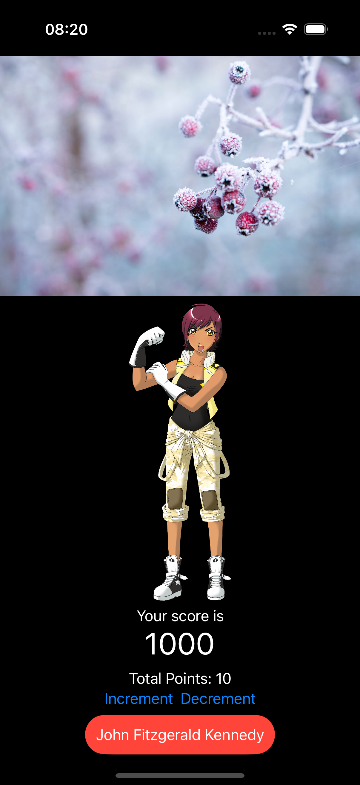

# Accessibility: Introduction

Paul Hudson's ([@twostraws](https://x.com/twostraws)) 100 Days of Swift UI Project 15.

## Project 15

Source URL: [Accessibility: Introduction](https://www.hackingwithswift.com/books/ios-swiftui/accessibility-introduction)

>Making your app accessible means taking steps to ensure that everyone can use it fully regardless of their individual needs. For example, if they are blind then your app should work well with the system’s VoiceOver system to ensure your UI can be read smoothly.

>SwiftUI gives us a huge amount of functionality for free, because its layout system of `VStack` and `HStack` naturally forms a flow of views. However, it isn’t perfect, and any time you can add some extra information to help out the iOS accessibility system it’s likely to help.

>Usually the best way to test out your app is to enable VoiceOver support and run the app on a real device – if your app works great with VoiceOver, there’s a good chance you’re already far ahead of the average for iOS apps.

The only way to test this is to enable VoiceOver in a real iOS device here: Settings > Accessibility > VoiceOver. Moreover, Paul emphasizes the importance of understanding how iOS changes once you VoiceOver is enabled: it's important to read the instructions in the VoiceOver settings screeen. I did not do it and I got completely lost to the point that I was unable to disable VoiceOver (shame on me!). I had to ask Siri to do it for me me.

### Identifying views with useful labels

Source URL: [Identifying views with useful labels](https://www.hackingwithswift.com/books/ios-swiftui/identifying-views-with-useful-labels)

>We can control what VoiceOver reads for a given view by attaching two modifiers: `.accessibilityLabel()` and `.accessibilityHint()`. They both take text containing anything we want, but they serve different purposes:

>1. The label is read immediately, and should be a short piece of text that gets right to the point. If this view deletes an item from the user’s data, it might say “Delete”.
>2. The hint is read after a short delay, and should provide more details on what the view is there for. It might say “Deletes an email from your inbox”, for example.

>The label is exactly what we need to solve the first of our problems, because it means we can leave the image name as it is while still having VoiceOver read out something that helps users.

### Hiding and grouping accessibility data

Source URL: [Hiding and grouping accessibility data](https://www.hackingwithswift.com/books/ios-swiftui/hiding-and-grouping-accessibility-data)

>If you spend even a few minutes with an active VoiceOver user, you’ll learn two things very quickly: they are remarkably adept at navigating around user interfaces, and they also often set reading speed extremely fast – way faster than you or I would use.

>It’s important to take both of those things into account when we’re designing our UI: these users aren’t just trying VoiceOver out of curiosity, but are instead VoiceOver power users who rely on it to access your app. As a result, it’s important we ensure our UI removes as much clutter as possible so that users can navigate through it quickly and not have to listen to VoiceOver reading unhelpful descriptions.

>Beyond setting labels and hints, there are several ways we can control what VoiceOver reads out. There are three in particular I want to focus on:

>- Marking images as being unimportant for VoiceOver.
>- Hiding views from the accessibility system.
>- Grouping several views as one.

### Reading the value of controls

Source URL: [Reading the value of controls](https://www.hackingwithswift.com/books/ios-swiftui/reading-the-value-of-controls)

>We can give iOS specific instructions for how to handle adjustment, by grouping our `VStack` together using `accessibilityElement()` and `accessibilityLabel()`, then by adding the `accessibilityValue()` and `accessibilityAdjustableAction()` modifiers to respond to swipes with custom code.

>Adjustable actions hand us the direction the user swiped, and we can respond however we want. There is one proviso: yes, we can choose between increment and decrement swipes, but we also need a special default case to handle unknown future values – Apple has reserved the right to add other kinds of adjustments in the future.

>Here’s how it looks in code:

```swift
VStack {
    Text("Value: \(value)")

    Button("Increment") {
        value += 1
    }

    Button("Decrement") {
        value -= 1
    }
}
.accessibilityElement()
.accessibilityLabel("Value")
.accessibilityValue(String(value))    
.accessibilityAdjustableAction { direction in
    switch direction {
    case .increment:
        value += 1
    case .decrement:
        value -= 1
    default:
        print("Not handled.")
    }
}
```

>That lets users select the whole `VStack` to have “Value: 10” read out, but then they can swipe up or down to manipulate the value and have just the numbers read out – it’s a much more natural way of working.

### Handling voice input in SwiftUI

Source URL: [Handling voice input in SwiftUI](https://www.hackingwithswift.com/books/ios-swiftui/handling-voice-input-in-swiftui)

>Once you've made sure your app works well with Voiceover, a great next step is to make sure it handles voice input too – that you work well with Apple's Voice Control technology, which lets users control your app by speaking to it.

>The `accessibilityInputLabels()` modifier accepts an array of strings that can be attached to our button, so the user can trigger it in a variety of ways. So, to trigger the button with three different phrases we'd use this:

```swift
Button("John Fitzgerald Kennedy") {
    print("Button tapped")
}
.accessibilityInputLabels(["John Fitzgerald Kennedy", "Kennedy", "JFK"])
```
>The goal is to help the user activate your controls using whatever seems natural to them – you can provide as many strings as you want, and iOS will listen for all of them.

### Final notes

The final result of my app is chaotic, because I wanted to exemplify each of Paul's teachings within a single view:

```swift
import SwiftUI

struct ContentView: View {
    let pictures = [
        "ales-krivec-15949",
        "galina-n-189483",
        "kevin-horstmann-141705",
        "nicolas-tissot-335096"
    ]
    
    @State private var selectedPicture = Int.random(in: 0...3)
    
    let labels = [
        "Tulips",
        "Frozen tree buds",
        "Sunflowers",
        "Fireworks",
    ]
    
    @State private var value = 10
    
    var body: some View {
        
        VStack {
            Button {
                selectedPicture = Int.random(in: 0...3)
            } label: {
                Image(pictures[selectedPicture])
                    .resizable()
                    .scaledToFit()
            }
            .accessibilityLabel(labels[selectedPicture])
            
            
            Image(decorative: "character")
                .resizable()
                .scaledToFit()
                .accessibilityHidden(true)
            
            VStack {
                Text("Your score is")
                Text("1000")
                    .font(.largeTitle)
            }
            .accessibilityElement(children: .ignore)
            .accessibilityLabel(Text("Your score is 1000"))
            
            Spacer()
            
            VStack {
                Text("Total Points: \(value)")
                
                HStack {
                    Button("Increment") {
                        value += 1
                    }
                    
                    Button("Decrement") {
                        value -= 1
                    }
                }
                .accessibilityElement()
                .accessibilityLabel("Value")
                .accessibilityValue(String(value))
                .accessibilityAdjustableAction { direction in
                switch direction {
                case .increment:
                        value += 1
                    case .decrement:
                        value -= 1
                    default:
                        print("Not supported")
                    }
                }
            }
            
            Spacer()
            
            VStack {
                Button("John Fitzgerald Kennedy") {
                    print("Button tapped")
                }
                .padding(12)
                .background(.red)
                .foregroundStyle(.white)
                .clipShape(.rect)
                .cornerRadius(25)
                .accessibilityInputLabels(["John Fitzgerald Kennedy", "Kennedy", "JFK"])
                
            }
        }
        
    }
}

#Preview {
    ContentView()
}
```

Here's the (chaotic) end result:

<div align="center">
    
</div>

Definitely not production ready! :smiley:

## Acknowledgments

Original code created by: [Paul Hudson - @twostraws](https://x.com/twostraws) (Thank you!)

Made with :heart: by [@cewitte](https://x.com/cewitte)